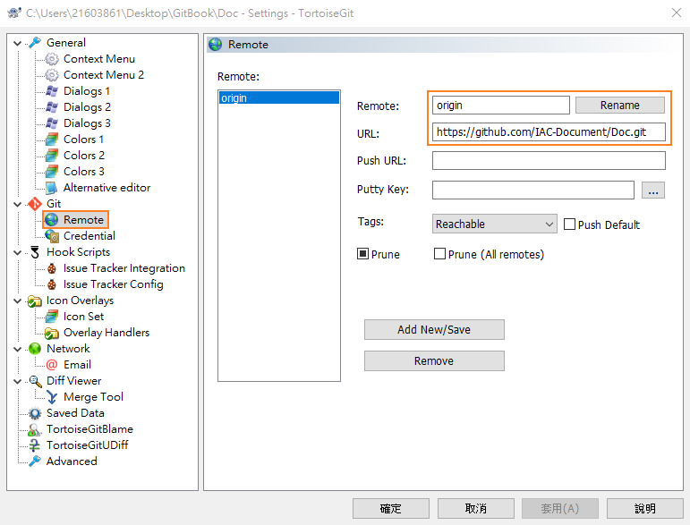

# IAC-Document管理資訊

UserName: IAC-Document

Host Email: peng.daniel@iac.com.tw (可更改)

password: Iac#12345

## 如何登錄GitBook?
https://peng-daniel.gitbook.io/iac-document/

gitbook管理頁面: https://app.gitbook.com/login > 選透過github登錄

# gitbook 同步命令整理

情境一: 同步IAC-Doucment
```Bash
mkdir gitbook
cd gitbook
git clone https://github.com/IAC-Document/Doc.git
git pull
```

情境二: 修改README.md文件並上傳
```Bash
先用editor修改README.md內容

然後執行以下命令: 
git add README.md
git commit -m "fix README.md"
git push -u origin main
```


# Doc Commit 格式 (To Be Define)
```git
Doc:
    README.md
Describe:
    基礎Gitbook使用教學
```

# TortoiseGit 設定
Gitbook帳號資訊:
```git
UserName: IAC-Document
password: Iac#12345
```



